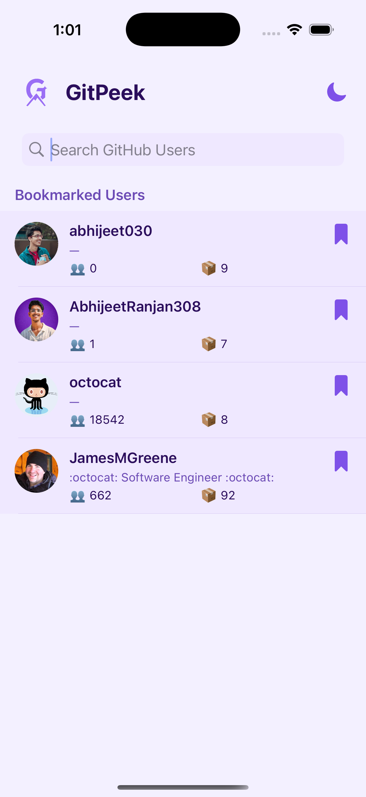
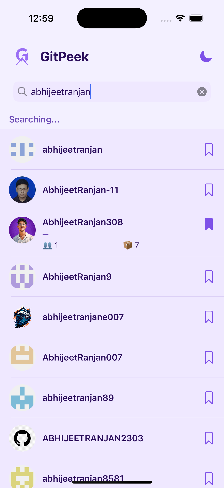
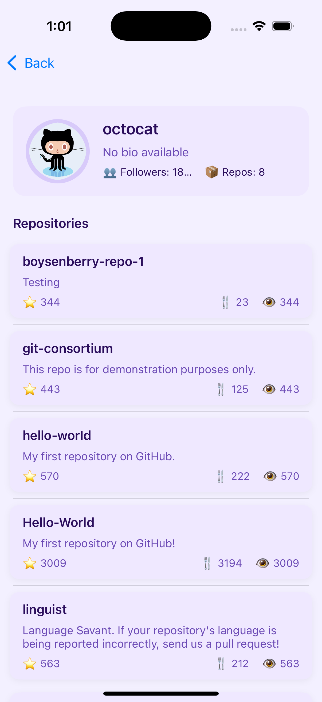
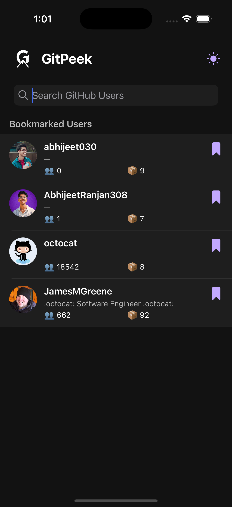
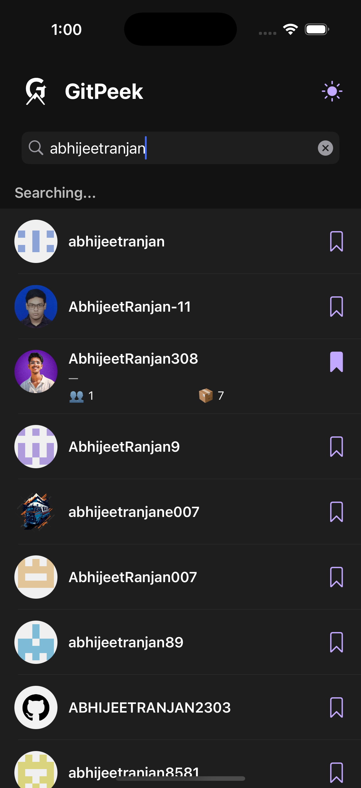
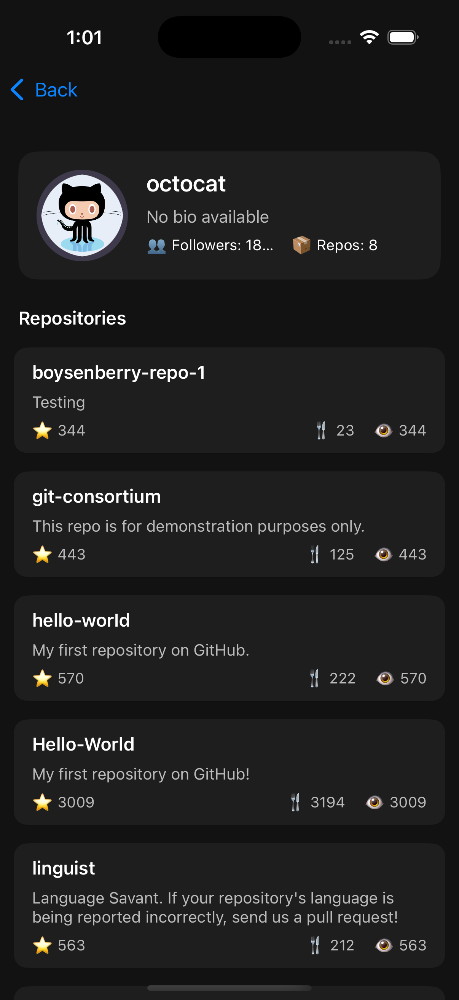

# GitPeek

GitPeek is a sleek and intuitive iOS application that allows users to search and explore GitHub profiles with ease. Whether you're browsing for inspiration or keeping tabs on your favorite developers, GitPeek offers a fast and feature-rich experience — complete with offline support and system-integrated theming.

---

## 🚀 Features

- 🔍 **Search GitHub Profiles**  
  Type in a username to instantly search and view GitHub user profiles in real-time.

- 📌 **Bookmarking**  
  Save your favorite profiles to revisit them later. Bookmarks persist even after app restarts and are accessible offline.

- 📴 **Offline Search**  
  Browse previously viewed or bookmarked profiles without an internet connection.

- 🌗 **Dark/Light Mode Support**  
  GitPeek automatically adjusts to your device’s theme — or manually toggle between light and dark modes.

- 📂 **Repository List with Pagination**  
  View a user's public repositories with smooth pagination. Pull to refresh for the latest updates.

---

## 📸 Screenshots

### 🔦 Light Mode





### 🌑 Dark Mode






---

## 🛠️ Getting Started

If you'd like to build the app locally:

1. Clone the repository:
   ```bash
   git clone https://github.com/abhijeet030/GitPeek.git
   cd gitpeek
